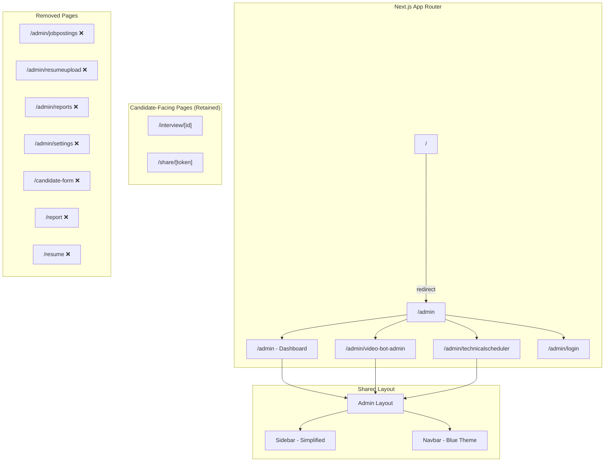
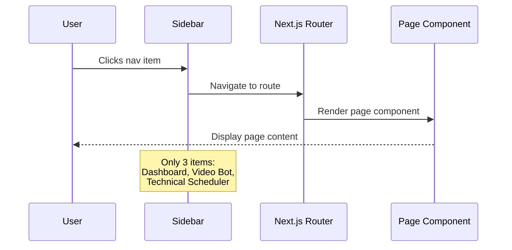
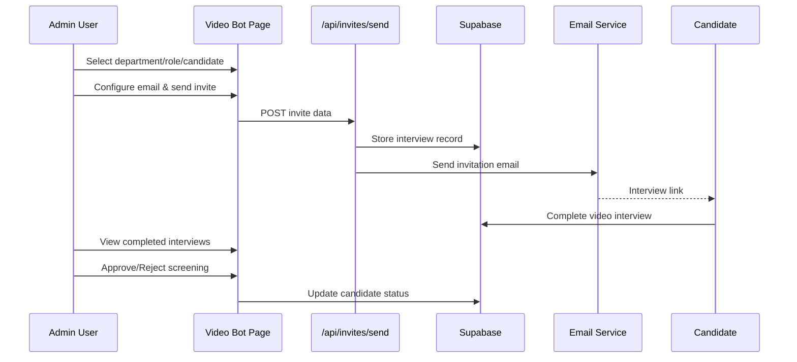
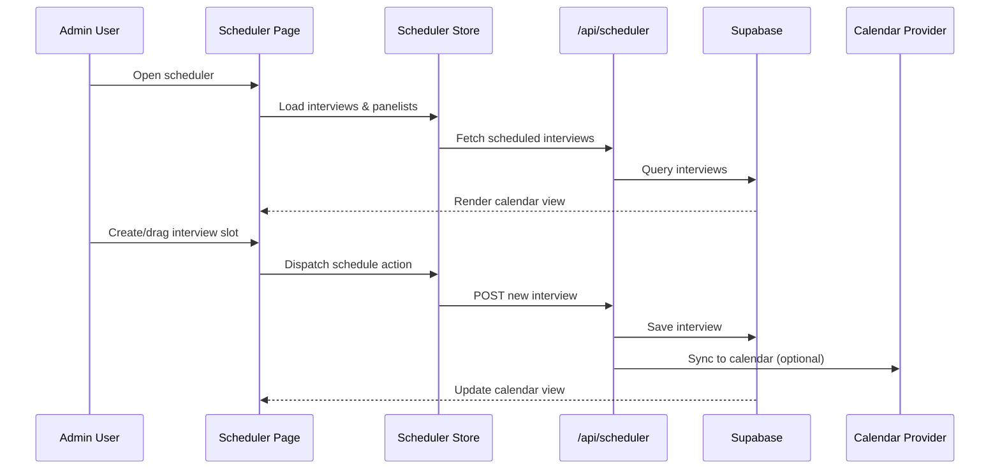

# Design Document: Platform UI Redesign

## Overview

This design covers the professional UI redesign of the Company Hire Portal for v1 release. The platform will be stripped down to only two core features — **Video Bot Screening** and **Technical Interview Scheduler** — with all other pages/features removed. The visual identity will shift to a blue-only color palette (shades of blue) for a clean, professional look, replacing the current green/navy branding. The goal is minimal pages, maximum clarity, and a polished SaaS-grade interface built with Next.js 15, TypeScript, Tailwind CSS, and shadcn/ui components.

The redesign involves three major workstreams: (1) navigation and page structure simplification, (2) color system overhaul to blue-only shades, and (3) component-level UI polish for the two retained features. The existing Supabase backend, API routes, and data models remain unchanged — this is purely a frontend/UI transformation.

## Architecture



## Sequence Diagrams

### Admin Navigation Flow



### Video Bot Screening Workflow



### Technical Interview Scheduling Flow



## Components and Interfaces

### Component 1: Sidebar (Redesigned)

**Purpose**: Minimal navigation with only the retained features, blue-themed styling

**Interface**:
```typescript
interface NavItem {
  name: string;
  path: string;
  icon: LucideIcon;
}

interface SidebarProps {
  // No props needed - uses pathname from Next.js
}

// Navigation items for v1
const NAV_ITEMS: NavItem[] = [
  { name: 'Dashboard', path: '/admin', icon: LayoutDashboard },
  { name: 'Video Screening', path: '/admin/video-bot-admin', icon: Video },
  { name: 'Interview Scheduler', path: '/admin/technicalscheduler', icon: Calendar },
];
```

**Responsibilities**:
- Render only 3 navigation items (Dashboard, Video Screening, Interview Scheduler)
- Highlight active route with blue accent
- Use blue-shade sidebar background (dark navy blue: `#0F2B5B`)
- Display company logo at top
- Provide logout action at bottom

### Component 2: Dashboard (Simplified)

**Purpose**: Overview metrics for video screening and technical interviews only

**Interface**:
```typescript
interface DashboardMetrics {
  totalCandidates: number;
  pendingScreenings: number;
  completedScreenings: number;
  scheduledInterviews: number;
  upcomingInterviews: number;
}

interface DashboardProps {
  // No props - fetches from AppContext
}
```

**Responsibilities**:
- Display KPI cards for video screening and scheduling metrics only
- Remove all charts/graphs related to removed features (resume, reports, departments)
- Use blue gradient cards for metrics
- Show recent activity feed for both modules

### Component 3: VideoBot Page (Retained, Restyled)

**Purpose**: Manage AI video interview invitations and review completed screenings

**Interface**:
```typescript
interface VideoBotPageState {
  interviews: Interview[];
  loading: boolean;
  inviteForm: InviteFormState;
  confirmModal: ConfirmModalState | null;
}

interface InviteFormState {
  candidateId: string;
  department: string;
  subDepartment: string;
  role: string;
  subject: string;
  body: string;
  senderEmail: string;
  targetEmail: string;
}
```

**Responsibilities**:
- Send video screening invitations to candidates
- Display interview status table (pending/completed/expired)
- Approve/reject completed video screenings
- Manage question bank
- Blue-themed cards, buttons, and status badges

### Component 4: TechnicalScheduler Page (Retained, Restyled)

**Purpose**: Calendar-based interface for scheduling technical interviews with panelists

**Interface**:
```typescript
interface SchedulerState {
  view: 'week' | 'day' | 'month';
  currentDate: Date;
  interviews: ScheduledInterview[];
  panelists: Panelist[];
  selectedInterview: ScheduledInterview | null;
}

interface ScheduledInterview {
  id: string;
  candidateName: string;
  candidateEmail: string;
  panelistIds: string[];
  startTime: Date;
  endTime: Date;
  platform: 'zoom' | 'teams' | 'meet';
  status: 'scheduled' | 'completed' | 'cancelled';
}
```

**Responsibilities**:
- Week/Day/Month calendar views
- Drag-and-drop interview scheduling
- Panelist availability sidebar
- Conflict detection
- Blue-themed calendar events and headers

## Data Models

### Blue Color System

```typescript
// New blue-only design tokens
interface BlueColorPalette {
  // Primary Blues
  blue50: '#EFF6FF';   // Lightest background
  blue100: '#DBEAFE';  // Light accent background
  blue200: '#BFDBFE';  // Border, subtle accent
  blue300: '#93C5FD';  // Hover states
  blue400: '#60A5FA';  // Secondary actions
  blue500: '#3B82F6';  // Primary action buttons
  blue600: '#2563EB';  // Primary hover
  blue700: '#1D4ED8';  // Strong accent
  blue800: '#1E40AF';  // Dark accent, headings
  blue900: '#1E3A8A';  // Sidebar background
  blue950: '#0F2B5B';  // Darkest, sidebar/navbar
}

// CSS Variable Mapping
interface DesignTokens {
  '--brand-primary': string;      // #3B82F6 (blue-500)
  '--brand-primary-hover': string; // #2563EB (blue-600)
  '--brand-dark': string;          // #0F2B5B (blue-950)
  '--brand-light': string;         // #EFF6FF (blue-50)
  '--sidebar-bg': string;          // #0F2B5B
  '--sidebar-active': string;      // rgba(59, 130, 246, 0.2)
  '--sidebar-text': string;        // rgba(255, 255, 255, 0.7)
  '--sidebar-text-active': string; // #ffffff
  '--accent-indicator': string;    // #3B82F6
}
```

**Validation Rules**:
- All color values must be from the blue shade palette
- No green (`#7DBA00`), red, or other hues in primary UI elements
- Status colors (success/warning/error) remain as semantic indicators but are secondary
- Charts (if any remain) use blue shades only

### Page Structure Model

```typescript
// Pages to KEEP
type RetainedRoutes = 
  | '/admin'                    // Dashboard (simplified)
  | '/admin/video-bot-admin'    // Video Bot Screening
  | '/admin/technicalscheduler' // Technical Interview Scheduler
  | '/admin/login'              // Login page
  | '/interview/[id]'          // Candidate-facing interview
  | '/share/[token]';          // Share link for completed interviews

// Pages to REMOVE
type RemovedRoutes =
  | '/admin/jobpostings'        // Department/Job management
  | '/admin/resumeupload'       // Resume upload & parsing
  | '/admin/reports'            // Reports & Evaluation
  | '/admin/settings'           // Email settings
  | '/candidate-form'           // Candidate form
  | '/report'                   // Public report page
  | '/resume';                  // Resume viewer
```

**Validation Rules**:
- Navigation must only link to retained routes
- Sidebar must have exactly 3 nav items (Dashboard, Video Screening, Scheduler)
- Root `/` must redirect to `/admin`
- Removed routes should return 404 or redirect to dashboard

## Algorithmic Pseudocode

### Color Migration Algorithm

```typescript
/**
 * ALGORITHM: migrateColorSystem
 * INPUT: CSS file content (globals.css)
 * OUTPUT: Updated CSS with blue-only palette
 * 
 * PRECONDITIONS:
 * - File contains existing CSS variables
 * - Brand colors use --brand-navy and --brand-green
 * 
 * POSTCONDITIONS:
 * - All --brand-green references replaced with blue equivalents
 * - Sidebar background uses blue-950
 * - Primary actions use blue-500
 * - No green color values remain in brand tokens
 */

function migrateColorSystem(cssContent: string): string {
  const replacements: Record<string, string> = {
    '--brand-green: #7DBA00': '--brand-primary: #3B82F6',
    '--brand-green-hover: #6ea300': '--brand-primary-hover: #2563EB',
    '--brand-navy: #0E2D7B': '--brand-dark: #0F2B5B',
    'rgba(125, 186, 0': 'rgba(59, 130, 246',  // green rgba → blue rgba
    'rgba(125,186,0': 'rgba(59,130,246',
  };

  let result = cssContent;
  for (const [oldValue, newValue] of Object.entries(replacements)) {
    result = result.replaceAll(oldValue, newValue);
  }
  return result;
}
```

### Navigation Filtering Algorithm

```typescript
/**
 * ALGORITHM: filterNavigation
 * INPUT: Full nav items array, v1 feature list
 * OUTPUT: Filtered nav items for v1
 * 
 * PRECONDITIONS:
 * - navItems contains all historical navigation entries
 * - v1Features is a set of allowed route paths
 * 
 * POSTCONDITIONS:
 * - Output contains only items where path is in v1Features
 * - Order is: Dashboard, Video Screening, Interview Scheduler
 */

const V1_ALLOWED_PATHS = new Set([
  '/admin',
  '/admin/video-bot-admin',
  '/admin/technicalscheduler',
]);

function getV1NavItems(allNavItems: NavItem[]): NavItem[] {
  return allNavItems
    .filter(item => V1_ALLOWED_PATHS.has(item.path))
    .sort((a, b) => {
      const order = ['/admin', '/admin/video-bot-admin', '/admin/technicalscheduler'];
      return order.indexOf(a.path) - order.indexOf(b.path);
    });
}
```

### Dashboard Metrics Calculation

```typescript
/**
 * ALGORITHM: calculateV1Metrics
 * INPUT: candidates[], interviews[] from Supabase
 * OUTPUT: DashboardMetrics object
 * 
 * PRECONDITIONS:
 * - candidates array is fetched and non-null
 * - Each candidate has video_stage_status field
 * 
 * POSTCONDITIONS:
 * - metrics.totalCandidates = candidates.length
 * - metrics.pendingScreenings = count where video not completed
 * - metrics.completedScreenings = count where video completed
 * - metrics.scheduledInterviews = count of upcoming technical interviews
 */

function calculateV1Metrics(
  candidates: Candidate[],
  interviews: ScheduledInterview[]
): DashboardMetrics {
  const now = new Date();

  return {
    totalCandidates: candidates.length,
    pendingScreenings: candidates.filter(
      c => c.video_stage_status === 'Pending' || !c.video_stage_status
    ).length,
    completedScreenings: candidates.filter(
      c => c.video_stage_status === 'Approved' || c.video_stage_status === 'Rejected'
    ).length,
    scheduledInterviews: interviews.filter(
      i => i.status === 'scheduled'
    ).length,
    upcomingInterviews: interviews.filter(
      i => i.status === 'scheduled' && new Date(i.startTime) > now
    ).length,
  };
}
```

## Key Functions with Formal Specifications

### Function 1: rebuildSidebar()

```typescript
function rebuildSidebar(): React.ReactElement
```

**Preconditions:**
- Component is rendered within Next.js app router context
- `usePathname()` hook is available

**Postconditions:**
- Returns sidebar with exactly 3 nav items + logout
- Active item is highlighted with blue-500 left border
- Sidebar background is `#0F2B5B` (blue-950)
- No references to removed features (resume, reports, settings, departments)

**Loop Invariants:** N/A

### Function 2: applyBlueTheme()

```typescript
function applyBlueTheme(element: HTMLElement): void
```

**Preconditions:**
- Element exists in DOM
- CSS custom properties are loaded in `:root`

**Postconditions:**
- All `--brand-green` usages render as `--brand-primary` (blue-500)
- Button primary color is `#3B82F6`
- Focus rings use blue-500 (`box-shadow: 0 0 0 3px rgba(59, 130, 246, 0.15)`)
- No green color visible in any UI element

**Loop Invariants:** N/A

### Function 3: simplifyDashboard()

```typescript
function simplifyDashboard(
  candidates: Candidate[],
  interviews: ScheduledInterview[]
): DashboardView
```

**Preconditions:**
- `candidates` is a valid array (may be empty)
- `interviews` is a valid array (may be empty)

**Postconditions:**
- Dashboard shows max 4 KPI cards (all video/scheduler related)
- No chart references resume scores, departments, or recommendations
- All card backgrounds use blue gradient tones
- Activity feed shows only video screening and scheduler events

**Loop Invariants:**
- For KPI calculation loops: running totals remain non-negative

## Example Usage

```typescript
// Example 1: Simplified Sidebar rendering
const Sidebar = () => {
  const pathname = usePathname();
  
  const navItems = [
    { name: 'Dashboard', path: '/admin', icon: LayoutDashboard },
    { name: 'Video Screening', path: '/admin/video-bot-admin', icon: Video },
    { name: 'Interview Scheduler', path: '/admin/technicalscheduler', icon: Calendar },
  ];

  return (
    <aside className="w-[260px] bg-[#0F2B5B] text-white flex flex-col h-screen">
      <div className="h-[73px] bg-white flex items-center justify-center border-b">
        
      </div>
      <nav className="flex-1 p-4 flex flex-col gap-2">
        {navItems.map(item => {
          const isActive = pathname === item.path || 
            (item.path !== '/admin' && pathname?.startsWith(item.path));
          return (
            <Link
              key={item.name}
              href={item.path}
              className={cn(
                "flex items-center gap-3 px-4 py-3 rounded-lg transition-all",
                "border-l-[3px]",
                isActive
                  ? "bg-blue-500/20 border-blue-400 text-white font-semibold"
                  : "border-transparent text-white/70 hover:text-white hover:bg-white/5"
              )}
            >
              <item.icon size={20} />
              {item.name}
            </Link>
          );
        })}
      </nav>
    </aside>
  );
};

// Example 2: Blue-themed KPI card
const MetricCard = ({ label, value, icon: Icon }: MetricCardProps) => (
  <div className="bg-white rounded-2xl border border-blue-100 shadow-sm p-6 
                  hover:shadow-md transition-shadow">
    <div className="flex items-center gap-4">
      <div className="w-12 h-12 rounded-xl bg-blue-500 flex items-center justify-center">
        <Icon size={22} className="text-white" />
      </div>
      <div>
        <p className="text-xs font-semibold text-blue-400 uppercase tracking-wider">
          {label}
        </p>
        <h3 className="text-2xl font-black text-slate-800 mt-1">{value}</h3>
      </div>
    </div>
  </div>
);

// Example 3: Updated CSS variables
const blueThemeCSS = `
  :root {
    --brand-primary: #3B82F6;
    --brand-primary-hover: #2563EB;
    --brand-dark: #0F2B5B;
    --brand-light: #EFF6FF;
    --sidebar-bg: #0F2B5B;
    --primary: #3B82F6;
    --primary-foreground: #ffffff;
  }
`;
```

## Correctness Properties

1. **∀ route ∈ SidebarLinks: route ∈ RetainedRoutes**
   - Every link in the sidebar must point to a retained v1 route

2. **∀ color ∈ PrimaryUIColors: isBlueShade(color) = true**
   - Every primary UI color (buttons, accents, borders, highlights) must be a shade of blue

3. **|SidebarNavItems| = 3**
   - The sidebar must contain exactly 3 navigation items

4. **∀ page ∈ RemovedRoutes: accessing(page) → redirect('/admin') ∨ 404**
   - Any attempt to access a removed page results in redirect or 404

5. **∀ component ∈ Dashboard: component.dataSource ∈ {candidates, scheduledInterviews}**
   - Dashboard components only reference video screening or scheduler data

6. **brandGreen ∉ CSSVariables ∧ brandGreen ∉ InlineStyles**
   - No green brand color remains in any styling

## Error Handling

### Error Scenario 1: Accessing Removed Routes

**Condition**: User navigates to `/admin/reports`, `/admin/settings`, etc.
**Response**: Next.js returns 404 page or middleware redirects to `/admin`
**Recovery**: User lands on dashboard with clear navigation options

### Error Scenario 2: Missing Color Variable Fallback

**Condition**: A component references old `--brand-green` variable after migration
**Response**: CSS falls back to `--brand-primary` (blue-500)  
**Recovery**: Developer identifies via CSS audit and updates the reference

### Error Scenario 3: Orphaned Component References

**Condition**: A retained component imports from a removed feature module
**Response**: Build fails with clear import error
**Recovery**: Remove the import and any dependent logic

## Testing Strategy

### Unit Testing Approach

- **Sidebar tests**: Verify exactly 3 nav items render, verify active state logic
- **Color token tests**: Snapshot test CSS variables to ensure no green values
- **Dashboard tests**: Verify only video/scheduler metrics are calculated
- **Route tests**: Verify removed routes are not accessible

### Property-Based Testing Approach

**Property Test Library**: vitest + fast-check (already in Next.js ecosystem)

- **Property**: For any generated route string, if it's in `RemovedRoutes`, the app does not render page content
- **Property**: For any randomly generated color from the theme, `hue(color)` falls within blue range (200-250°)

### Integration Testing Approach

- End-to-end navigation flow: login → dashboard → video screening → scheduler
- Verify sidebar highlights correct item for each route
- Visual regression testing to ensure no green colors leak through

## Performance Considerations

- Removing 4+ pages and their chart libraries (recharts with 12 charts) significantly reduces the bundle size on the dashboard
- Simplified sidebar means fewer DOM nodes and faster layout calculations
- Blue-only theme requires updating CSS variables, not adding new stylesheets
- The scheduler module (dynamic import) remains unchanged in load behavior

## Security Considerations

- Authentication flow unchanged — middleware.ts continues to protect admin routes
- Removed routes should still be protected by middleware (defense in depth)
- No new API endpoints introduced
- Session/cookie handling remains identical

## Dependencies

- **Existing (retained)**: Next.js 15.3.6, React 19, TypeScript, Tailwind CSS 3.4, @supabase/supabase-js, Radix UI, shadcn/ui, lucide-react, framer-motion, date-fns
- **Existing (can be removed)**: recharts (if dashboard charts fully removed), html2pdf.js (reports), pdf2json (resume parsing)
- **No new dependencies required** — the redesign uses existing Tailwind blue palette utilities
