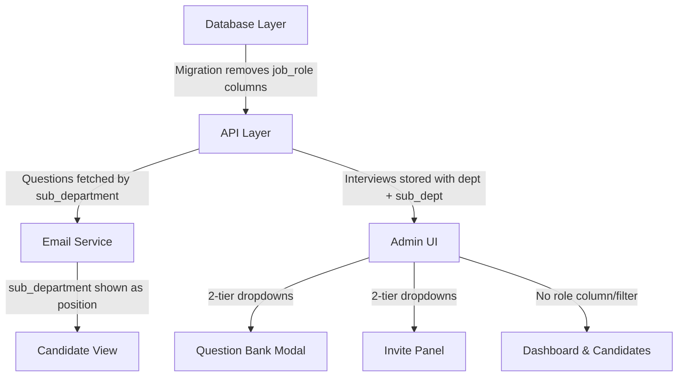
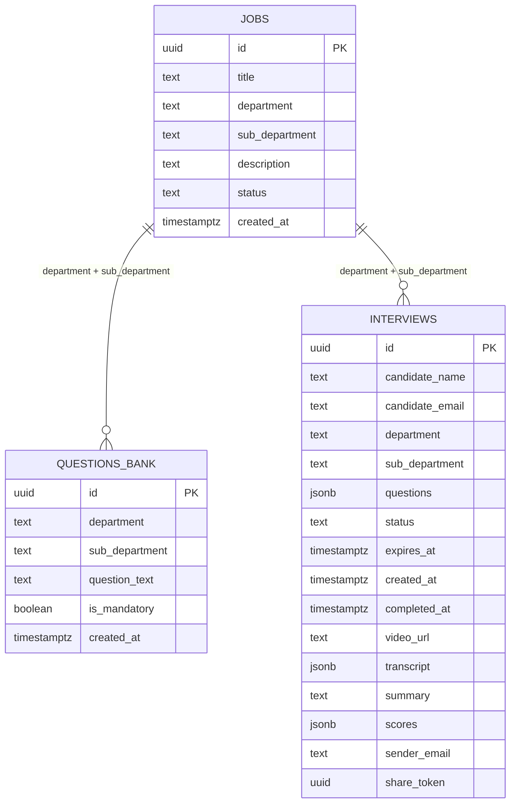

# Design Document: Remove Role Hierarchy

## Overview

This design describes the refactoring of the KL Hire Interview platform from a three-tier organizational hierarchy (Department → Sub-Department → Role) to a two-tier hierarchy (Department → Sub-Department). The change removes the `job_role` column from the `questions_bank` and `interviews` tables, consolidates the `jobs` table to represent department/sub-department pairs, and updates all API endpoints, TypeScript types, email templates, and UI components to reflect the simplified model.

The core principle: **sub-department becomes the lowest organizational level**, replacing role as the unit that determines which questions a candidate receives.

## Architecture

The change is a vertical slice across all layers:



**Migration strategy**: A single SQL migration file handles all schema changes. Application code changes are deployed simultaneously since the removed columns will no longer exist.

## Components and Interfaces

### 1. Database Migration (`supabase/migrations/YYYYMMDD_remove_role_hierarchy.sql`)

The migration performs three operations in a transaction:

1. **Drop `job_role` from `questions_bank`** — Questions are already associated with `department` + `sub_department` columns. The `job_role` column is redundant.
2. **Drop `job_role` from `interviews`** — Add `department` and `sub_department` columns to `interviews` first (for existing rows, populate from the `jobs` table or set defaults), then drop `job_role`.
3. **Consolidate `jobs` table** — Deduplicate rows that share the same `department` + `sub_department`. Keep one representative row per pair. Set `title = sub_department` for the surviving rows.

```sql
-- Step 1: Add department/sub_department to interviews (backfill before dropping job_role)
ALTER TABLE public.interviews ADD COLUMN IF NOT EXISTS department text;
ALTER TABLE public.interviews ADD COLUMN IF NOT EXISTS sub_department text;

-- Backfill interviews from jobs table using job_role → title match
UPDATE public.interviews i
SET department = j.department,
    sub_department = COALESCE(j.sub_department, j.title)
FROM public.jobs j
WHERE i.job_role = j.title
  AND i.department IS NULL;

-- For any interviews that didn't match, set defaults
UPDATE public.interviews
SET department = COALESCE(department, 'General'),
    sub_department = COALESCE(sub_department, job_role, 'General')
WHERE department IS NULL OR sub_department IS NULL;

-- Step 2: Drop job_role columns
ALTER TABLE public.questions_bank DROP COLUMN IF EXISTS job_role;
ALTER TABLE public.interviews DROP COLUMN IF EXISTS job_role;

-- Step 3: Consolidate jobs table - keep one row per dept+sub_dept
DELETE FROM public.jobs
WHERE id NOT IN (
  SELECT DISTINCT ON (department, COALESCE(sub_department, title))
    id
  FROM public.jobs
  ORDER BY department, COALESCE(sub_department, title), created_at ASC
);

-- Normalize: set sub_department = title where sub_department is null
UPDATE public.jobs SET sub_department = title WHERE sub_department IS NULL;
-- Set title = sub_department for consistency
UPDATE public.jobs SET title = sub_department;
```

**Idempotency**: All statements use `IF EXISTS`/`IF NOT EXISTS` and conditional `WHERE` clauses, making re-execution safe.

### 2. Updated Schema (`master_schema.sql`)

```sql
-- questions_bank (after migration)
CREATE TABLE IF NOT EXISTS public.questions_bank (
  id uuid DEFAULT gen_random_uuid() PRIMARY KEY,
  department text DEFAULT 'General',
  sub_department text NOT NULL DEFAULT 'General',
  question_text text NOT NULL,
  is_mandatory boolean DEFAULT false,
  created_at timestamp with time zone DEFAULT timezone('utc'::text, now()) NOT NULL
);

-- interviews (after migration)
CREATE TABLE IF NOT EXISTS public.interviews (
  id uuid DEFAULT gen_random_uuid() PRIMARY KEY,
  candidate_name text NOT NULL,
  candidate_email text NOT NULL,
  department text NOT NULL DEFAULT 'General',
  sub_department text NOT NULL DEFAULT 'General',
  questions jsonb NOT NULL DEFAULT '[]'::jsonb,
  status text NOT NULL DEFAULT 'pending' CHECK (status IN ('pending', 'completed')),
  expires_at timestamp with time zone NOT NULL,
  created_at timestamp with time zone DEFAULT timezone('utc'::text, now()) NOT NULL,
  completed_at timestamp with time zone,
  video_url text,
  transcript jsonb,
  summary text,
  scores jsonb,
  sender_email text,
  share_token uuid DEFAULT gen_random_uuid() NOT NULL UNIQUE
);

-- jobs (after migration - represents dept/sub_dept pairs)
CREATE TABLE IF NOT EXISTS public.jobs (
  id uuid DEFAULT gen_random_uuid() PRIMARY KEY,
  title text NOT NULL,           -- equals sub_department (kept for backward compat)
  department text NOT NULL,
  sub_department text NOT NULL,
  description text,
  status text DEFAULT 'Active' CHECK (status IN ('Active', 'Archived')),
  created_at timestamp with time zone DEFAULT timezone('utc'::text, now()) NOT NULL
);
```

### 3. TypeScript Types (`src/types/index.ts`)

```typescript
export interface Interview {
  id: string;
  candidate_name: string;
  candidate_email: string;
  department: string;
  sub_department: string;
  questions: string[];
  status: "pending" | "completed" | "expired";
  expires_at: string;
  created_at: string;
  completed_at: string | null;
  video_url: string | null;
  transcript: TranscriptEntry[] | null;
  summary?: string;
  scores?: Record<string, number>;
  share_token: string;
  sender_email?: string;
}

export interface CreateInterviewInput {
  candidate_name: string;
  candidate_email: string;
  department: string;
  sub_department: string;
  questions: string[];
  expires_at: string;
}
```

### 4. Questions API (`/api/questions/route.ts`)

**Changes**:
- `POST`: Remove `job_role` from insert. Require `sub_department`. Use `department` + `sub_department` as the association.
- `GET`: Order by `department` + `sub_department` instead of `job_role`.
- Validation: Reject requests without a valid `sub_department`.

```typescript
// POST handler - key changes
const { question_text, is_mandatory, department, sub_department } = body;

if (!question_text || !sub_department) {
  return NextResponse.json(
    { error: "question_text and sub_department are required" },
    { status: 400 }
  );
}

await supabase.from("questions_bank").insert({
  question_text,
  is_mandatory: is_mandatory || false,
  department: department || 'General',
  sub_department,
});
```

### 5. Invite API (`/api/invites/send/route.ts`)

**Changes**:
- Remove `role` from required fields validation.
- Fetch questions by `sub_department` instead of role.
- Store `department` + `sub_department` on the interview record (not `job_role`).
- Pass `sub_department` to email service as position identifier.

```typescript
// Fetch questions by sub_department
const { data: questions } = await supabase
  .from("questions_bank")
  .select("*")
  .eq("sub_department", sub_department);

// Create interview without job_role
const { data: interview } = await supabase
  .from("interviews")
  .insert({
    candidate_name,
    candidate_email,
    department,
    sub_department,
    questions: selectedQuestions,
    status: "pending",
    expires_at: expiry,
    sender_email: senderEmail || null,
  })
  .select()
  .single();

// Email uses sub_department as position
await fetch(emailUrl, {
  method: "POST",
  body: JSON.stringify({
    type: "invite",
    to: candidate_email,
    candidateName: candidate_name,
    jobRole: sub_department,  // sub_department is now the position label
    interviewId: interview.id,
    expiresAt: expiry,
  }),
});
```

### 6. Interviews API (`/api/interviews/route.ts`)

**Changes**:
- `POST`: Accept `department` + `sub_department` instead of `job_role`.
- Validation: Require `department` and `sub_department`.

```typescript
const { candidate_name, candidate_email, department, sub_department, questions, expires_at } = body;

if (!candidate_name || !candidate_email || !department || !sub_department || !questions?.length) {
  return NextResponse.json({ error: "Missing required fields" }, { status: 400 });
}
```

### 7. Email Service (`/api/emails/send/route.ts`)

**Changes**:
- The `jobRole` parameter passed to email templates now contains the `sub_department` value.
- No structural changes to the email template functions — they already use a `jobRole` parameter for position display. The caller simply passes `sub_department` instead.
- Email subject lines use `sub_department` where they previously used `job_role`.

The email template functions (`inviteEmailTemplate`, `completionEmailTemplate`, etc.) receive a `position` parameter (renamed from `jobRole` for clarity):

```typescript
// Rename parameter for clarity
function inviteEmailTemplate(
  candidateName: string,
  position: string,  // was jobRole, now receives sub_department
  interviewId: string,
  expiresAt: string,
  customBody?: string
): string { ... }
```

### 8. Admin UI Components

**QuestionBankModal.tsx**:
- Remove third "Role" dropdown from both the add form and filter controls.
- Remove `getAvailableRoles()` helper.
- Remove `newRole`, `selectedRole` state variables.
- Grid changes from 3-column to 2-column layout.

**Video Bot Admin (invite panel)**:
- Remove `inviteRole` state and role dropdown.
- Remove `getAvailableRoles()` helper.
- Send invite with only `department` + `sub_department`.

**Candidates page**:
- Remove `selectedRole` filter state.
- Remove role dropdown from filter bar.

**Job Postings page**:
- Manage department + sub-department pairs only.
- No role creation/editing.

**AppContext.tsx**:
- No structural changes needed (it already fetches jobs as-is). The `getAvailableRoles()` function is only defined locally in components, not in the context.

### 9. Candidate-Facing Pages

**Interview page** (`/interview/[id]/page.tsx`):
- Display `department` and `sub_department` where `job_role` was shown.

**Share page** (`/share/[token]/page.tsx`):
- Display `department` and `sub_department` instead of `job_role`.

**Dashboard pages** (`/video-bot-admin/dashboard/*`):
- Remove `job_role` column from tables.
- Show `sub_department` as position where needed.

### 10. Seed Data (`seed_defaults.js`)

Update to set both `title` and `sub_department` for each entry:

```javascript
toInsert.push({
  title: subDept,
  department: dept,
  sub_department: subDept,
  status: 'Active'
});
```

## Data Models

### Entity Relationship (After Migration)



### Key Design Decisions

| Decision | Choice | Rationale |
|----------|--------|-----------|
| Keep `title` column in `jobs`? | Yes, set `title = sub_department` | Avoids breaking any code that reads `jobs.title`. Backward compatible. |
| How to link interviews to org? | Add `department` + `sub_department` columns to `interviews` | Direct storage avoids joins. Simple queries. |
| How to backfill existing interviews? | Match `job_role` → `jobs.title` to find dept/sub_dept | The current `job_role` values correspond to `jobs.title` values. |
| What replaces `job_role` in email display? | Use `sub_department` as the position label | Sub-department is the most specific organizational label remaining. |
| Rename `jobRole` parameter in email templates? | Rename to `position` internally | Clearer semantics, but the value passed is `sub_department`. |

## Correctness Properties

*A property is a characteristic or behavior that should hold true across all valid executions of a system — essentially, a formal statement about what the system should do. Properties serve as the bridge between human-readable specifications and machine-verifiable correctness guarantees.*

### Property 1: Question creation associates department and sub_department

*For any* valid department and sub_department string pair, creating a question via the Questions API shall store both values on the resulting question record, and no `job_role` field shall be present.

**Validates: Requirements 3.1**

### Property 2: Question fetching by sub_department returns correct questions

*For any* sub_department value that has associated questions in the bank, fetching questions by that sub_department shall return exactly the set of questions whose `sub_department` field matches, regardless of their department value.

**Validates: Requirements 3.2, 4.1**

### Property 3: Question filtering returns only matching records

*For any* combination of department filter and sub_department filter applied to a set of questions, the filtered result shall contain only questions where both the department and sub_department match the filter values (when specified).

**Validates: Requirements 3.3**

### Property 4: Missing sub_department rejects question creation

*For any* question creation request where `sub_department` is null, empty, or missing entirely, the Questions API shall return a 400 status code and shall not insert any record.

**Validates: Requirements 3.4**

### Property 5: Interview creation stores department and sub_department without job_role

*For any* valid interview creation with department and sub_department values, the resulting interview record shall contain both fields and shall not contain a `job_role` field.

**Validates: Requirements 4.2**

### Property 6: Role parameter is ignored in invite requests

*For any* valid invite request, including or excluding a `role` field in the request body shall produce identical interview records (same questions fetched, same department/sub_department stored).

**Validates: Requirements 4.4**

### Property 7: Email templates use sub_department as position identifier

*For any* sub_department string value, all email template outputs (invite, completion, MCQ, form) shall contain the sub_department value in both the subject line and the position display field, and shall not reference a separate job_role value.

**Validates: Requirements 6.1, 6.2, 6.5**

## Error Handling

| Scenario | Response |
|----------|----------|
| Question creation without `sub_department` | 400: `"question_text and sub_department are required"` |
| Invite without `department` or `sub_department` | 400: `"Missing required fields"` |
| No questions found for given `sub_department` | 400: `"No questions found for {department} - {sub_department}"` |
| Interview creation without `department`/`sub_department` | 400: `"Missing required fields"` |
| Migration on already-migrated database | No-op (idempotent — `IF EXISTS` guards) |
| Existing interviews with no matching job in `jobs` table | Backfill sets `department = 'General'`, `sub_department` = original `job_role` value or `'General'` |

## Testing Strategy

### Unit Tests (Example-Based)

- **Migration correctness**: Verify schema changes on a test database (columns dropped, data preserved).
- **UI structure**: Verify QuestionBankModal renders 2 dropdowns (no role dropdown).
- **UI structure**: Verify invite panel renders 2 dropdowns (no role dropdown).
- **UI structure**: Verify candidates page has no role filter.
- **TypeScript compilation**: Verify build succeeds with updated types (no `job_role` references compile).

### Property-Based Tests

Property-based testing is appropriate here because the API logic (question creation, fetching, filtering, interview creation) involves pure input/output transformations that vary meaningfully with different inputs.

**Library**: [fast-check](https://github.com/dubzzz/fast-check) (TypeScript PBT library)
**Configuration**: Minimum 100 iterations per property test.

Each property test references its design property:
- **Feature: remove-role-hierarchy, Property 1**: Question creation stores dept + sub_dept
- **Feature: remove-role-hierarchy, Property 2**: Question fetch by sub_department
- **Feature: remove-role-hierarchy, Property 3**: Filter correctness
- **Feature: remove-role-hierarchy, Property 4**: Validation rejects missing sub_department
- **Feature: remove-role-hierarchy, Property 5**: Interview stores dept/sub_dept without job_role
- **Feature: remove-role-hierarchy, Property 6**: Role parameter ignored
- **Feature: remove-role-hierarchy, Property 7**: Email templates use sub_department

### Integration Tests

- Run migration on a seeded test database, verify data integrity.
- End-to-end invite flow: create questions → send invite → verify interview record.
- Migration idempotency: run migration twice, verify no errors.
