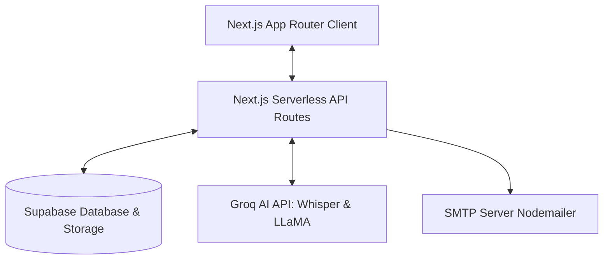
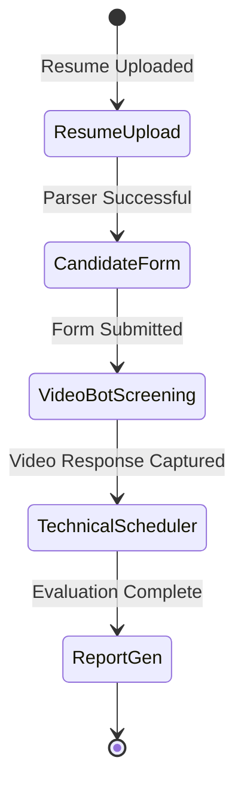
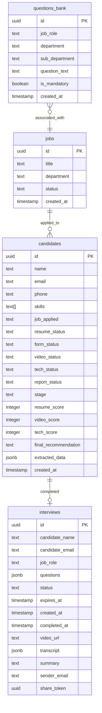
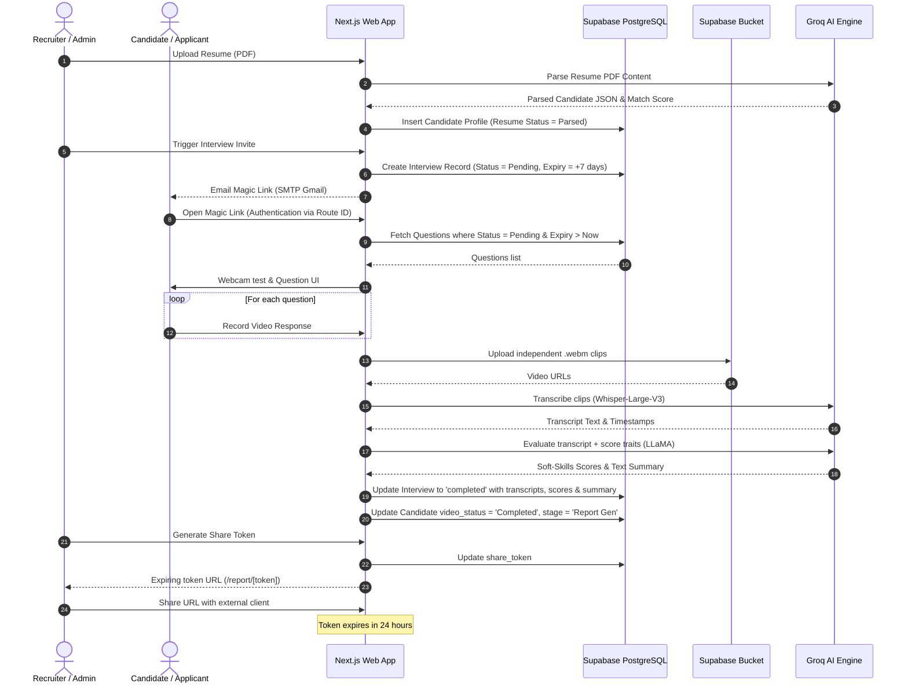

# Software Requirements Specification (SRS)

## 🎥 Project: Video Screening Bot / Company Hire Portal
**Version:** 1.0.0  
**Date:** June 10, 2026  
**Status:** Approved  

---

## Table of Contents
1. [Introduction](#1-introduction)
   - 1.1 [Purpose](#11-purpose)
   - 1.2 [Document Conventions](#12-document-conventions)
   - 1.3 [Intended Audience and Reading Suggestions](#13-intended-audience-and-reading-suggestions)
   - 1.4 [Product Scope](#14-product-scope)
   - 1.5 [References](#15-references)
2. [Overall Description](#2-overall-description)
   - 2.1 [Product Perspective](#21-product-perspective)
   - 2.2 [Product Functions](#22-product-functions)
   - 2.3 [User Classes and Characteristics](#23-user-classes-and-characteristics)
   - 2.4 [Operating Environment](#24-operating-environment)
   - 2.5 [Design and Implementation Constraints](#25-design-and-implementation-constraints)
   - 2.6 [User Documentation](#26-user-documentation)
   - 2.7 [Assumptions and Dependencies](#27-assumptions-and-dependencies)
3. [External Interface Requirements](#3-external-interface-requirements)
   - 3.1 [User Interfaces](#31-user-interfaces)
   - 3.2 [Hardware Interfaces](#32-hardware-interfaces)
   - 3.3 [Software Interfaces](#33-software-interfaces)
   - 3.4 [Communications Interfaces](#34-communications-interfaces)
4. [System Features (Functional Requirements)](#4-system-features-functional-requirements)
   - 4.1 [Candidate Resume Upload & AI-Driven ATS Parser](#41-candidate-resume-upload--ai-driven-ats-parser)
   - 4.2 [Candidate Pipeline Tracking & Status Transitions](#42-candidate-pipeline-tracking--status-transitions)
   - 4.3 [Browser-based One-Way Video Bot Interview Recording](#43-browser-based-one-way-video-bot-interview-recording)
   - 4.4 [Automated Speech-to-Text Transcription via Groq Whisper](#44-automated-speech-to-text-transcription-via-groq-whisper)
   - 4.5 [AI Evaluation, Soft-Skills Analysis, and Scoring via Groq LLaMA](#45-ai-evaluation-soft-skills-analysis-and-scoring-via-groq-llama)
   - 4.6 [Admin Dashboard & Skill Match Visualizations](#46-admin-dashboard--skill-match-visualizations)
   - 4.7 [Secure Shareable Expiring Report Links](#47-secure-shareable-expiring-report-links)
5. [Other Non-Functional Requirements](#5-other-non-functional-requirements)
   - 5.1 [Performance Requirements](#51-performance-requirements)
   - 5.2 [Safety and Security Requirements](#52-safety-and-security-requirements)
   - 5.3 [Reliability & Availability](#53-reliability--availability)
   - 5.4 [Usability](#54-usability)
   - 5.5 [Maintainability & Extensibility](#55-maintainability--extensibility)
6. [Data Dictionary & Database Schema](#6-data-dictionary--database-schema)
   - 6.1 [Schema Overview & RLS Policies](#61-schema-overview--rls-policies)
   - 6.2 [Database Table Definitions](#62-database-table-definitions)
   - 6.3 [Storage Buckets Configuration](#63-storage-buckets-configuration)
7. [System Architecture & Workflow Diagram](#7-system-architecture--workflow-diagram)

---

## 1. Introduction

### 1.1 Purpose
This document specifies the software requirements for the **Video Screening Bot / Company Hire Portal** (internally known as **KL HIRE Unified**). It serves as the primary agreement between stakeholders, developers, and testers, outlining the system's functional boundaries, external interface interactions, architectural foundations, data schema, and quality benchmarks.

### 1.2 Document Conventions
- This document uses standard markdown formatting.
- Bold text denotes primary UI components, key software libraries, database fields, or specific system actions.
- Code blocks represent schemas, configuration blocks, or database scripts.
- Visual flows are detailed using standard UML-like diagrams generated via **Mermaid**.

### 1.3 Intended Audience and Reading Suggestions
- **Developers**: Read Section 3 (External Interfaces), Section 4 (System Features), Section 6 (Database Schema), and Section 7 (System Architecture).
- **Q/A and Testers**: Refer to Section 4 (System Features) and Section 5 (Non-Functional Requirements) to write system and acceptance test suites.
- **Product Owners / Stakeholders**: Focus on Section 2 (Overall Description) and Section 4 (System Features) to verify functional scopes.

### 1.4 Product Scope
The **Video Screening Bot** is a modern, high-speed application tracking system (ATS) integrated with an automated one-way video bot interview module. Candidates apply by uploading their resumes, which are parsed by LLaMA models. Approved candidates proceed to recorded browser-based interviews. The platform transcribes the recorded video on the fly, computes an AI review, auto-grades candidates against mandatory requirements, and displays interactive skill summaries (radar and bar charts) on an administrative dashboard. The system also supports generating expiring secure links to share performance portfolios with external clients.

### 1.5 References
- [tech_stack.txt](./tech_stack.txt): Core technical framework description.
- [README.md](./README.md): Running the repository locally.
- [supabase-schema.sql](./supabase-schema.sql): Database definitions for interviews and questions.
- [jobs-candidates-schema.sql](./jobs-candidates-schema.sql): Database definitions for candidates and listed jobs.

---

## 2. Overall Description

### 2.1 Product Perspective
The system functions as a self-contained, cloud-enabled Next.js application integrated with a remote **Supabase** backend. Instead of relying on client-side compute or heavy video-processing servers, it delegates speech transcription and soft-skill summaries to the high-throughput **Groq Cloud API**. Magic links are dispatched via automated Gmail SMTP, and static deployment is designed for **Vercel**.

### 2.2 Product Functions
The portal performs the following core business processes:
1. **Resume Ingestion**: Extracts text from PDF resumes, parses details (skills, experience, projects) with an LLM, and populates PostgreSQL tables.
2. **Workflow Progression**: Manages the candidate lifecycle stage by stage (Resume Upload -> Candidate Form -> Video Bot Screening -> Technical Scheduler -> Report Generation).
3. **One-Way Interview Management**: Invites candidates via email, plays randomized job-specific questions, and streams webm chunks from user webcams directly to secure storage.
4. **Speech-to-Text Transcription**: Connects to Whisper APIs immediately on interview completion to compile transcripts with timestamp mapping.
5. **AI Summarization & Scoring**: Summarizes transcripts, flags inactive/silent recordings, scores candidate responses, and compiles soft skill ratings.
6. **Data Visualization**: Represents Candidate metrics using custom Radix-based dashboards complete with Interactive Recharts components.
7. **Report Sharing**: Sends expiring tokenized URLs to decision-makers, giving them read-only visual scorecards.

### 2.3 User Classes and Characteristics
- **Admins/Recruiters**: Highly active users. They manage jobs, review parsed candidate lists, trigger interview invites, modify AI reports, and evaluate candidate scorecards.
- **Candidates**: Single-session users. They complete application forms, record video responses, and view interview status updates. Requires high usability and zero complex installation.
- **External Clients / Hiring Managers**: Passive reviewers. They open read-only shareable links on mobile or desktop to review interview videos, transcripts, and AI-generated skills charts.

### 2.4 Operating Environment
- **Client Web Browser**: Modern desktop or mobile browsers supporting **HTML5 MediaRecorder API**, WebRTC, and ES6+. Recommended: Google Chrome, Safari, Microsoft Edge, Mozilla Firefox.
- **Server Environment**: Next.js Serverless Environments (Node.js 20+ runtimes on Vercel).
- **Backend Database**: Supabase PostgreSQL cloud instance.
- **Storage**: Supabase Object Storage Buckets.

### 2.5 Design and Implementation Constraints
- **Video Format Constraint**: Video clips must be processed as lightweight, browser-native `.webm` media files.
- **AI Token Constraints**: Candidate evaluations must stay within Groq LLaMA token constraints, meaning long transcripts should be parsed efficiently.
- **Magic Link Expiration**: Shared administrative reports must automatically expire exactly 24 hours after token generation.
- **Strict Client-Side Merging Ban**: To prevent CPU bottlenecks on mobile client devices, the platform must upload individual video clips independently instead of merging multiple recordings client-side.

### 2.6 User Documentation
- Administrators utilize the README.md instructions for initial env setup and Supabase schema deployment.
- Candidate interface contains on-screen tooltips, browser webcam permission guidelines, and straightforward prompt instructions.

### 2.7 Assumptions and Dependencies
- **Groq API Availability**: The transcription and evaluation pipelines depend on the uptime of `api.groq.com`.
- **Supabase Connectivity**: Authentication, Row Level Security, storage uploads, and PostgreSQL persistence depend on Supabase cloud.
- **SMTP Gateway**: Email verification and magic link invitations rely on a valid SMTP provider configuration (such as Gmail App Passwords).

---

## 3. External Interface Requirements

### 3.1 User Interfaces
- **Admin Authentication (`/admin/login`)**: Secure form interface utilizing administrative password tokens.
- **Listed Jobs Manager (`/admin/jobs` or `/admin`)**: View active listed jobs, configure job roles, and map interview question lists.
- **Candidate Pipeline Dashboard (`/admin/candidates` or `/admin`)**: Table representing candidates, resume scores, pipeline stages, and actions (e.g., delete, add remarks, verify emails, send invites).
- **Interview Review Interface (`/admin/candidates/[id]/report` or similar)**: A light-themed visual console containing:
  - An embedded video player with visual clip thumbnail selector.
  - A side panel showing an auto-scrolling transcript.
  - Interactive transcript navigation (clicking on a sentence jumps the video player directly to that timestamp).
  - A detailed scorecard (radar charts, AI summary, strengths, and weaknesses).
- **Candidate Portal (`/candidate-form/[id]` & `/interview/[id]`)**: Minimalist, glassmorphism UI guiding candidates through email confirmation, webcam checking, and sequentially reading/recording question responses.

### 3.2 Hardware Interfaces
- **Webcam & Microphone**: Required by candidate devices to record video responses during the Video Bot Screening stage.
- **Speaker / Audio Output**: Required by review managers to listen to interview recordings.

### 3.3 Software Interfaces
- **Supabase SDK (`@supabase/supabase-js`, `@supabase/ssr`)**: Relational database interaction and media uploads to the `interview-recordings` bucket.
- **Groq API Client**: Translates transcripts and generates metrics using Whisper-Large-V3 and LLaMA 3.1/3.3 models.
- **Nodemailer**: Connects with external SMTP hosts to dispatch candidate links.
- **FFmpeg WASM**: Utilized for client-side container processing to verify standard webm formats prior to Supabase Storage ingress.
- **PDF2JSON**: Extracts plain-text data from candidate resume PDFs.
- **HTML2PDF.js**: Exports reports as documents client-side.

### 3.4 Communications Interfaces
- **HTTPS**: Encrypts all client-to-server traffic, administrative dashboard loads, and remote API calls.
- **SMTP/TLS**: Sends automated messages securely using Port 587.
- **Object Storage URLs**: Delivers recorded videos through public, securely configured CDN links with storage policies.

---

## 4. System Features (Functional Requirements)

### 4.1 Candidate Resume Upload & AI-Driven ATS Parser
- **Description**: Recruiter uploads a candidate's resume PDF. The system extracts text content via **PDF2JSON**, feeds the structured stream to Groq LLaMA, parses metadata, and populates candidate parameters.
- **Functional Requirements**:
  - Extract candidate name, email, phone, skills list, professional experience, education, and representative projects.
  - Compute a **Resume Match Score** (out of 100) based on targeted role criteria.
  - Store extracted JSON arrays in PostgreSQL `JSONB` fields (`extracted_data`).
  - Provide a 3-dots context menu on the candidates table for deleting resumes and cleaning corresponding storage paths.

### 4.2 Candidate Pipeline Tracking & Status Transitions
- **Description**: Transitions candidates through five distinct stages based on their progression status.
- **Functional Requirements**:
  - **Resume Upload**: Candidate profile is parsed and registered.
  - **Candidate Form**: Candidate verifies credentials and completes supplementary details.
  - **Video Bot Screening**: Candidate records one-way video bot responses.
  - **Technical Scheduler**: Automated stage for planning external interactive tech rounds.
  - **Report Generation**: AI analyzes outputs and constructs visual admin dashboards.
  - Reset status tags automatically whenever a recruiter sends a fresh invite link.

### 4.3 Browser-based One-Way Video Bot Interview Recording
- **Description**: Presents interview questions sequentially, capturing audio/video recordings in the browser.
- **Functional Requirements**:
  - Stream camera feeds directly into video element src objects to prevent black-screen preview errors.
  - Control recording using the HTML5 MediaRecorder API.
  - Auto-advance to the next question when the candidate clicks "Next Question" or when the time limit expires.
  - Upload recorded video clips independently to prevent browser crashes caused by client-side merging.

### 4.4 Automated Speech-to-Text Transcription via Groq Whisper
- **Description**: As soon as candidates finish their interviews, the system sends the audio streams to Groq's Whisper API.
- **Functional Requirements**:
  - Convert recorded video clips to audio-compatible chunks.
  - Deliver chunks to the `whisper-large-v3` model.
  - Extract detailed words, sentences, and timestamps.
  - Align transcripts sequentially with the database question records.

### 4.5 AI Evaluation, Soft-Skills Analysis, and Scoring via Groq LLaMA
- **Description**: The system evaluates transcripts to grade candidate answers and summarize their traits.
- **Functional Requirements**:
  - Use Groq LLaMA models to compile a 3-to-4 bullet-point summary highlighting soft-skills, communication style, and relevant experience.
  - Generate numerical scores (out of 100) for key dimensions: **Clarity**, **Confidence**, **Technical Proficiency**, and **Alignment**.
  - **Silence Penalty**: Train prompt logic strictly to flag, penalize, and grade non-responsive or silent candidate recording segments.

### 4.6 Admin Dashboard & Skill Match Visualizations
- **Description**: Displays candidate details and performance reviews on the Admin Reports Dashboard.
- **Functional Requirements**:
  - Render an interactive **Skill Radar Chart** displaying computed AI scores across Clarity, Confidence, Technical Proficiency, and Alignment.
  - Render bar chart comparison matrices illustrating candidate performance relative to average applicants.
  - Provide an inline text-editor for administrators to tweak the AI-generated summaries before sharing.

### 4.7 Secure Shareable Expiring Report Links
- **Description**: Generates secure links to share candidate portfolios without sharing login credentials.
- **Functional Requirements**:
  - Generate a secure, unique UUID `share_token` mapped to the completed interview record.
  - Construct read-only report routes (`/report/[token]`).
  - Automatically expire links exactly 24 hours after generation.
  - Hide sensitive candidate contact details (such as email and phone) on shared read-only screens to protect candidate privacy.

---

## 5. Other Non-Functional Requirements

### 5.1 Performance Requirements
- **Transcription Speed**: Groq Whisper speech-to-text API calls must complete within 5 seconds of the interview submission.
- **Video Playback Ingress**: Clicking a transcript segment must jump the video playback timeline to the corresponding timestamp in less than 150ms.
- **Resource Usage**: Client-side memory usage during recording must stay under 200MB to support mobile browser sessions.

### 5.2 Safety and Security Requirements
- **Access Control (Middleware)**: Protect all `/admin/*` and `/video-bot-admin/*` routes. Redirect unauthenticated users to `/admin/login` if the `kl_admin_session` cookie is missing.
- **Row Level Security (RLS)**: Enforce RLS policies on all Supabase tables. Allow anonymous users to write video recordings to storage, but restrict file deletion and reading of uncompleted interviews to authenticated administrators.
- **Internal API Protections**: Safeguard backend serverless endpoints using custom header validations (`x-api-key`).

### 5.3 Reliability & Availability
- **Availability**: Maintain system uptime above 99.5% by hosting API routes and frontend pages on Vercel's multi-region edge serverless framework.
- **Fault-Tolerant Uploads**: Implement copy-to-clipboard fallbacks and local storage backups if network interruptions disconnect candidate sessions.

### 5.4 Usability
- **Modern Theme Standards**: Implement glassmorphic layouts, dark mode parameters for candidates, and high-readability light modes for recruiters reviewing transcripts.
- **Aesthetic Consistency**: Styled entirely with Tailwind CSS utility classes and Lucide React icons.

### 5.5 Maintainability & Extensibility
- **Relational Integrity**: Enforce schema constraints, foreign key mappings, check conditions, and default values across all tables.
- **Typing Strictness**: Codebase must build clean with zero TypeScript compiler errors or ESLint violations.

---

## 6. Data Dictionary & Database Schema

### 6.1 Schema Overview & RLS Policies
The database is hosted on **Supabase (PostgreSQL)** and contains four primary tables (`interviews`, `questions_bank`, `jobs`, and `candidates`). Row Level Security (RLS) is enabled across all tables, ensuring strict separation of administrative privileges and candidate-facing operations.

### 6.2 Database Table Definitions

#### 6.2.1 `public.jobs`
Holds details of open roles listed on the portal.
- **id**: `uuid`, Primary Key, Defaults to `gen_random_uuid()`.
- **title**: `text`, Not Null. The job title (e.g. "Senior Frontend Engineer").
- **department**: `text`, Not Null. (e.g. "Engineering").
- **status**: `text`, Default `'Active'`, check constraint `(status in ('Active', 'Archived'))`.
- **created_at**: `timestamp with time zone`, Defaults to UTC `now()`.

#### 6.2.2 `public.candidates`
Holds candidates' parsed details, resume scores, pipeline stages, and evaluation history.
- **id**: `uuid`, Primary Key, Defaults to `gen_random_uuid()`.
- **name**: `text`, Not Null.
- **email**: `text`, Not Null.
- **phone**: `text`, Nullable.
- **skills**: `text[]`, Defaults to empty array `'{}'::text[]`.
- **job_applied**: `text`, Nullable. Maps to job role titles.
- **resume_status**: `text`, Default `'Pending'`.
- **form_status**: `text`, Default `'Pending'`.
- **video_status**: `text`, Default `'Pending'`.
- **tech_status**: `text`, Default `'Pending'`.
- **report_status**: `text`, Default `'Not Shared'`.
- **stage**: `text`, Default `'Resume Upload'`.
- **resume_score**: `integer`, Nullable.
- **video_score**: `integer`, Nullable.
- **tech_score**: `integer`, Nullable.
- **final_recommendation**: `text`, Default `'Under Review'`.
- **extracted_data**: `jsonb`, Nullable. Holds parsed metadata (experience, education, projects, etc.).
- **created_at**: `timestamp with time zone`, Defaults to UTC `now()`.

#### 6.2.3 `public.interviews`
Records active, expired, and completed video screening interviews.
- **id**: `uuid`, Primary Key, Defaults to `gen_random_uuid()`.
- **candidate_name**: `text`, Not Null.
- **candidate_email**: `text`, Not Null.
- **job_role**: `text`, Not Null.
- **questions**: `jsonb`, Default `'[]'::jsonb`. List of questions assigned to this session.
- **status**: `text`, Default `'pending'`, check constraint `(status in ('pending', 'completed'))`.
- **expires_at**: `timestamp with time zone`, Not Null. Magic link expiration limit.
- **created_at**: `timestamp with time zone`, Defaults to UTC `now()`.
- **completed_at**: `timestamp with time zone`, Nullable. Recorded when video and transcripts are finalized.
- **video_url**: `text`, Nullable. Direct URL to the stored recording.
- **transcript**: `jsonb`, Nullable. Array of object transcripts with format `[{question, text, timestamp}]`.
- **summary**: `text`, Nullable. AI-generated markdown summary.
- **sender_email**: `text`, Nullable. Email of the recruiter who sent the invite.
- **share_token**: `uuid`, Default `gen_random_uuid()`, Unique constraint. Expirable report link key.

#### 6.2.4 `public.questions_bank`
The question repository mapped to specific listed job roles.
- **id**: `uuid`, Primary Key, Defaults to `gen_random_uuid()`.
- **job_role**: `text`, Not Null. Target job title.
- **department**: `text`, Defaults to `'General'`.
- **sub_department**: `text`, Defaults to `'General'`.
- **question_text**: `text`, Not Null. The interview question.
- **is_mandatory**: `boolean`, Defaults to `false`.
- **created_at**: `timestamp with time zone`, Defaults to UTC `now()`.

### 6.3 Storage Buckets Configuration
- **Bucket ID**: `interview-recordings`
- **File size limit**: 500MB (`524288000` bytes).
- **Public access**: Enabled (`public = true`).
- **Access Policies**:
  - `Public can read interview recordings`: Select access granted to `public` where `bucket_id = 'interview-recordings'`.
  - `Candidates can upload interview recordings`: Insert access granted to `anon` where `bucket_id = 'interview-recordings'`.
  - `Admins can delete recordings`: Delete access restricted to `authenticated` users only where `bucket_id = 'interview-recordings'`.

---

## 7. System Architecture & Workflow Diagram

The flowchart below demonstrates the full end-to-end integration logic, routing flow, and third-party APIs involved.

---
*End of Software Requirements Specification (SRS) Document.*
